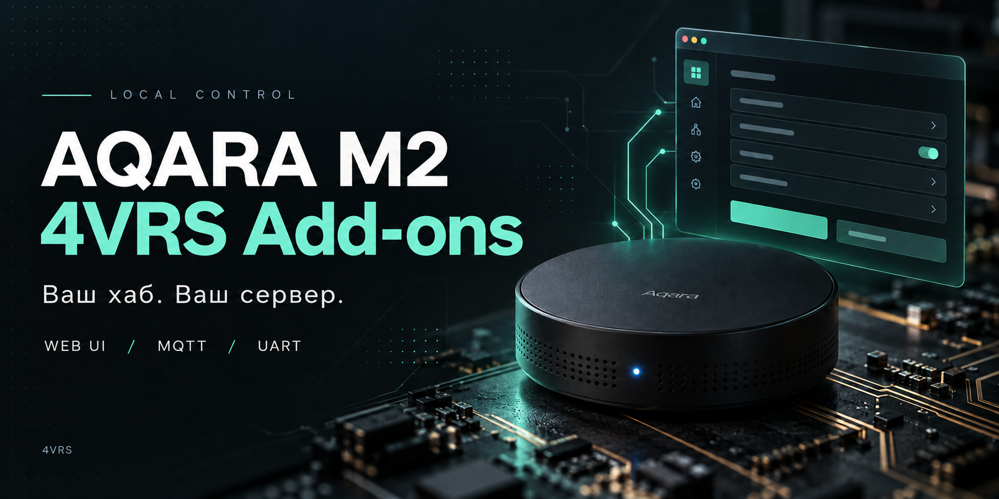
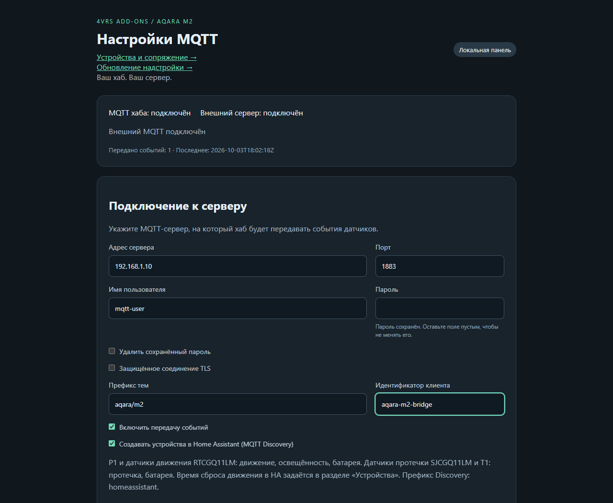
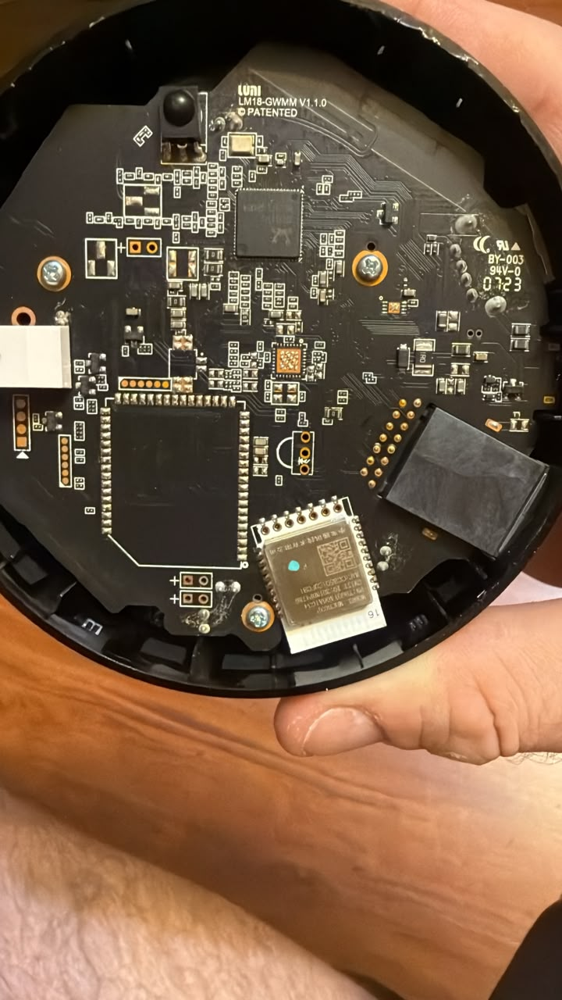
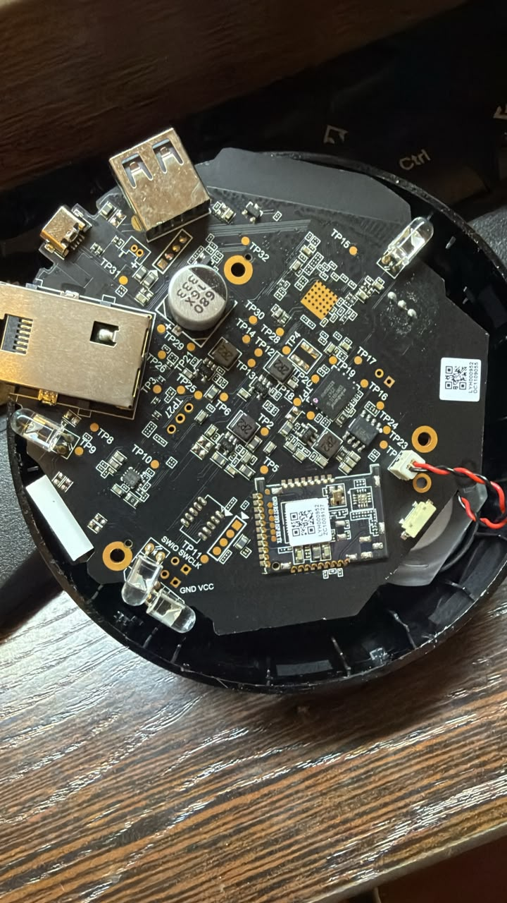
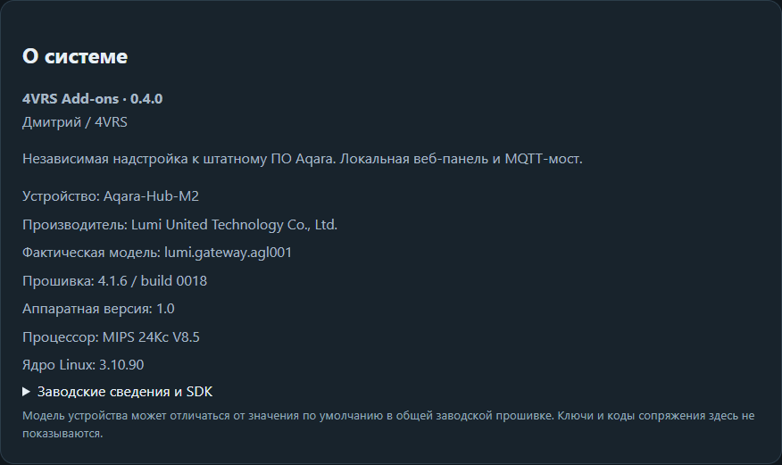
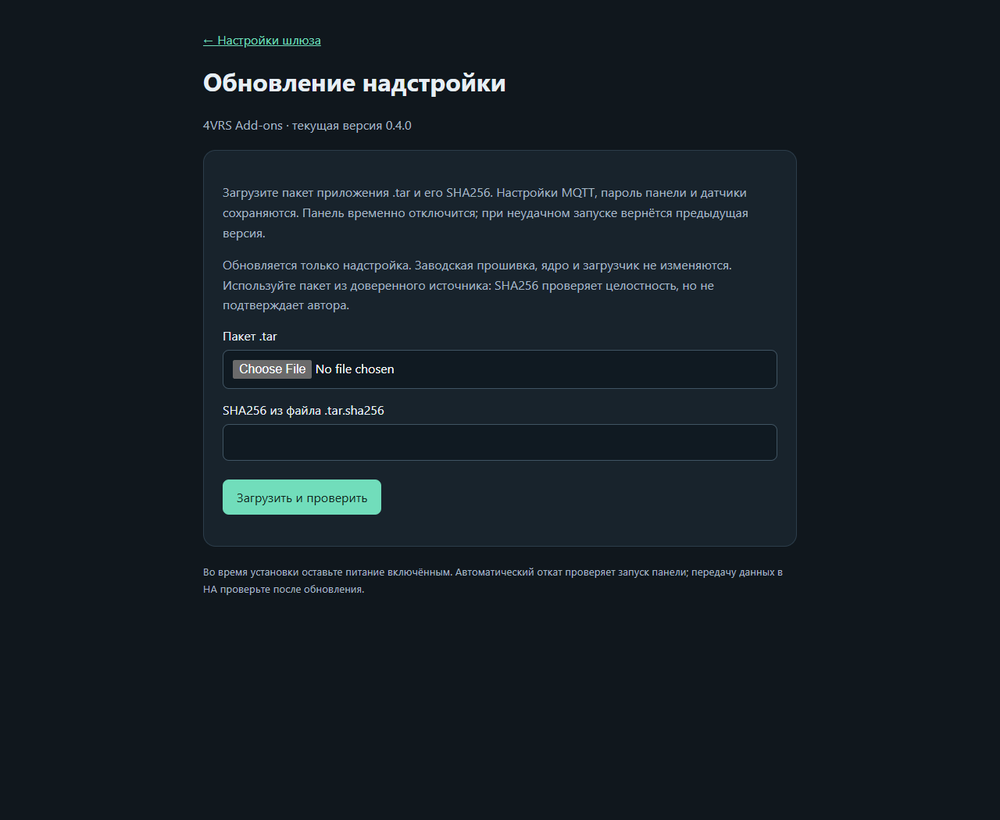

# Aqara M2 Local · 4VRS Add-ons



**Ваш хаб. Ваш сервер. Настройки в браузере.**

Репозиторий: [dk-1983/Aqara-Hub-M2-local](https://github.com/dk-1983/Aqara-Hub-M2-local).

Независимая надстройка для Aqara Hub M2: **локальная веб-панель**, настройка MQTT-сервера без UART и редактирования файлов, и передача событий датчиков из внутреннего MQTT хаба.

Проект вырос из простого вопроса: почему Aqara P1 показывает освещённость в Aqara Home, а Home Assistant через HomeKit Device получает только движение? Мы получили root по UART, сняли резервные копии и нашли движение **и люксы** во внутреннем MQTT. Затем добавили датчик затопления локальной MQTT-командой при заблокированном доступе хаба в интернет.

**Статус: экспериментальная версия 0.4.1 на одном M2; движение, люксы и протечка подтверждены в HA.** Это надстройка к штатному ПО, а не новая прошивка, универсальный Zigbee-координатор или готовая замена всех функций HomeKit.

Готовый пакет приложения и SHA256: [предварительный релиз v0.4.1](https://github.com/dk-1983/Aqara-Hub-M2-local/releases/tag/v0.4.1). Начните с [инструкции установщика](installer/README.md). Это **не полный образ заводской прошивки**. 4 октября 2026 на исследуемом M2 проверены обновление 0.4.0 → 0.4.1 через браузер и чистая установка опубликованного пакета в отсутствующий каталог надстройки. Новый пароль работает, все пять штатных Zigbee-привязок сохранились. После возвращения пользовательских настроек MQTT-мост возобновил передачу событий. Root и загрузочный хук были подготовлены заранее; весь заводской путь на втором устройстве не проверялся.



## Главная возможность — веб-интерфейс на самом M2

Откройте локальный адрес хаба в браузере и настройте:

- адрес и порт своего MQTT-сервера;
- имя пользователя и пароль;
- TLS и собственный CA-сертификат;
- префикс тем и идентификатор клиента;
- включение и выключение передачи событий;
- автоматическое создание MQTT-сущностей Home Assistant для поддержанных датчиков;
- обновление надстройки загрузкой проверенного пакета через браузер;
- смену пароля входа в веб-панель;
- просмотр и обновление сохранённой копии root/UART-пароля;
- чтение MAC, IP, маски, шлюза и DNS, настройку DHCP/static с откатом через 90 секунд без подтверждения.

Кнопка **«Проверить соединение»** проверяет MQTT-подключение и принятие учётных данных сервером. **«Сохранить и применить»** сохраняет настройки на хабе и перенастраивает мост.

Панель показывает соединение с внутренним и внешним MQTT, количество переданных событий и время последней передачи. В разделе **About / О системе** — заводские сведения Aqara, фактическая модель устройства, версия штатного ПО, платформа и авторы надстройки.

**Для смены MQTT-сервера после установки не требуется разбирать хаб или подключать UART.**

По умолчанию панель слушает HTTP на порту 80 в доверенной локальной сети. Для внешнего доступа используется HTTPS обратного прокси с сохранением заголовка Host. HTTP-участок до хаба не шифруется. По желанию собственный HTTPS включается флагами -https -listen :443 с индивидуальным сертификатом. Пароль панели создаётся отдельно от системного admin. Сохранённый MQTT-пароль не отправляется обратно в браузер. Новый пароль панели хранится как PBKDF2-HMAC-SHA256 с индивидуальной солью. Конфигурация записывается атомарно с правами 0600. Пароль MQTT хранится на хабе в открытом виде внутри закрытого файла: работающему клиенту он нужен для подключения.

## Как это устроено

```text
Датчики Zigbee
      │
      ▼
Штатный zigbee_agent M2
      │
      ▼
Штатный MQTT 127.0.0.1:1883 ──► 4VRS Add-ons ──► Ваш MQTT-сервер
                                     │                 │
                                Веб-панель       Home Assistant*
```

Внутренний брокер не заменяется и не открывается наружу. Мост подписывается на `zigbee/send` и публикует исходный JSON в `<префикс>/zigbee/send` с QoS 1, без retain.

Для поддержанных датчиков мост дополнительно публикует MQTT Discovery и отдельные темы состояний. Нужна стандартная интеграция MQTT в HA; AqaraGateway, Telnet и облачный токен для этого не требуются.

## Что подтверждено экспериментом

| Проверка | Результат |
| --- | --- |
| Root по UART после перезагрузки | Работает |
| Резервная копия всех девяти MTD-разделов | SHA256 каждой копии совпал с чтением хаба |
| P1: движение и освещённость во внутреннем MQTT | Получены реальные отчёты с 11 и 40 лк |
| Добавление свободного датчика затопления локальной командой | Успешно |
| Добавление второго датчика при заблокированной внешней маршрутизации | Успешно |
| Появление добавленного датчика в HomeKit Device | Подтверждено пользователем |
| HTTPS-панель на штатной прошивке | Работает |
| Вход, проверка MQTT, сохранение, перечитывание и выключение моста через браузер | Проверено на хабе |
| Смена пароля панели и вход после перезапуска процесса | Проверено на хабе |
| Копия root-пароля: сохранение, показ и скрытие | Проверено на хабе; системный пароль не меняется |
| DHCP → static с тем же IP → автоматический откат через 90 секунд | Проверено; watchdog пережил перезапуск панели |
| Минимальная правка rootfs для автозапуска | Изменён только rcS; загрузка и перезапуск панели проверены |
| Загрузчик, ядро и заводская идентичность | Не изменялись |
| Добавление и удаление датчика протечки через панель | Подтверждено пользователем |

Офлайн-тест проводился на **уже настроенном** M2. Он не доказывает независимую первичную настройку после сброса или работу любых Zigbee-устройств.

Подробный журнал методики и границ проверок: [EXPERIMENTS.md](EXPERIMENTS.md).

## Проверенное оборудование

- Корпус: **Aqara Hub M2 HM2-G01**.
- Фактическая модель: `lumi.gateway.agl001` (new Global в AqaraGateway).
- Плата: **LM18-GWMM V1.1.0**.
- SoC: **RTL8197F / MIPS 24Kc**, little-endian.
- Linux **3.10.90**, 64 МБ физической RAM.
- Штатное ПО: **4.1.6_0018.0650**; build.prop сообщает 4.1.6 / build 0018.
- P1: `lumi.motion.ac02`; датчик затопления: `lumi.sensor_wleak.aq1`.

В общем образе build.prop модель по умолчанию — `lumi.gateway.iragl5` / ZHWG12LM, а фактическое свойство и устройство — `lumi.gateway.agl001` / HM2-G01. Панель различает эти сведения. **Не выбирайте прошивку только по одному полю build.prop.**

## Количество устройств

Производитель заявляет [до 128 дочерних Zigbee-устройств при наличии ретрансляторов](https://www.aqara.com/en/product/hub-m2). Это характеристика Aqara, а не результат нагрузочного испытания надстройки. Программный тест обработал список из 127 P1 и 381 уникальную сущность Discovery; физическая Zigbee-сеть такого размера нами не проверялась. Внутренний предел разбора инвентаря не является ёмкостью хаба.

## Фотографии исследуемого хаба

| Плата, сторона A | Плата, сторона B |
| --- | --- |
|  |  |

Фотографии предоставлены Дмитрием / 4VRS. Фото нижней наклейки с HomeKit-кодом, заводские дампы, секреты и полные рабочие журналы в репозиторий не включены.

## Совместимость первого релиза

Поддержку заявляем только для исследованного HM2-G01, PCB LM18-GWMM V1.1.0, RTL8197F, ПО 4.1.6_0018.0650. Совпадение названия M2, внешнего вида или семейства процессора не подтверждает совместимость. Первичная установка требует root-доступа по UART и собственной проверенной резервной копии. Получение root пока не автоматизировано; это ограничение первого установочного комплекта.

После первоначальной установки версии 0.4.0 дальнейшие пакеты приложения загружаются на странице «Обновление надстройки». Корпус можно закрыть; UART остаётся способом восстановления при серьёзном сбое.

## Сборка и установка

Установка разделена на два независимых этапа:

1. [Подготовка оборудования, root-консоль и загрузочный хук](HARDWARE_SETUP.md) — однократно, по материалам исследования нашей платы.
2. [Установка надстройки на подготовленный хаб](installer/README.md) — готовый пакет из Releases, проверка, создание индивидуального пароля и запуск. Все компоненты приложения уже включены в пакет; скачивать зависимости на хаб не требуется. Штатные сопряжения Zigbee сохраняются.

Исходники: [webpanel](webpanel). Зависимости фиксируются в `go.mod` и `go.sum`.

```sh
cd webpanel
go test ./...
CGO_ENABLED=0 GOOS=linux GOARCH=mipsle GOMIPS=softfloat \
  go build -trimpath -ldflags="-s -w" -o panel-mipsle .
```

Проверенная сборка — Go 1.27.1. Нужен уже полученный root-доступ к совместимому M2. Пошаговая установка, создание индивидуального пароля и откат: [INSTALL.md](INSTALL.md).

Для воспроизводимой установки подготовлен [установочный комплект](installer/README.md): сборщик чистого архива приложения, установщик с сохранением настроек и отдельный сборщик минимального rootfs-хука из собственного проверенного дампа. Образ конкретного настроенного хаба не распространяется. Обновление приложения после установки хука не требует перепрошивки rootfs.

Панель доступна по `http://<IP-хаба>`, список датчиков — по /devices. Учётная запись панели — `admin`, пароль находится в созданном при установке `panel-password.txt`.

Скриншоты ниже сняты с работающей версии 0.4.0; сетевые параметры обезличены.





## Обратная связь

Ошибки установки, проблемы работы и запросы поддержки новых датчиков принимаем в [Issues](https://github.com/dk-1983/Aqara-Hub-M2-local/issues). Укажите модель и ревизию платы, штатную прошивку, версию надстройки, шаги и результат. Перед публикацией удалите из журналов пароли, токены, HomeKit-коды и идентификаторы устройств. Заводские дампы и конфигурацию с секретами прикладывать не нужно.

## Home Assistant через MQTT

Включите в панели передачу событий и «Создавать устройства в Home Assistant». В HA должна быть настроена стандартная интеграция MQTT на тот же брокер с включённым Discovery и префиксом homeassistant. HACS, Telnet и токен Aqara не нужны.

Список моделей читается из /data/zigbee/device.info и обновляется каждые 30 секунд. Поддержанные устройства публикуют описания в homeassistant/<тип>/4vrs_<идентификатор>/<сущность>/config, значения — в <префикс>/devices/<did>/<сущность>. Идентификаторы сущностей сохраняются при изменении префикса. Учётной записи брокера нужны права публикации этих тем и подписки на homeassistant/status.

Движение автоматически сбрасывается в HA через заданное для устройства время без нового события (по умолчанию 60 секунд). Это отдельная настройка от интервала обнаружения P1. Сообщения движения не сохраняются и не воспроизводятся после переподключения. Протечка, освещённость и батарея сохраняют последнее полученное значение на брокере (retained). До первого отчёта значение может быть неизвестным. Heartbeat обновляет батарею, но не заменяет измерение освещённости служебным нулём.

Доступность показывает соединения моста с внутренним и внешним MQTT, а не наличие каждого датчика в эфире. Индивидуальный контроль пропавших датчиков пока не реализован. После неожиданного обрыва внешний брокер публикует LWT offline. Отключение Discovery оставляет созданные сущности недоступными; для удаления их описаний очистите соответствующие retained config-темы. При смене брокера старые записи в старом брокере автоматически не очищаются.

## Устройства и настройки P1

Страница **/devices** работает с внутренним MQTT независимо от включения внешнего моста. Здесь можно:

- открыть сопряжение на 60 секунд, закрыть окно и увидеть новые устройства;
- найти датчик: включить прослушивание и кратко нажать кнопку на его корпусе;
- сохранить понятное имя и индивидуальное время сброса движения в HA;
- настроить интервал обнаружения пользователей P1 (10, 30, 60, 120 или 180 секунд), чувствительность (низкая/средняя/высокая), индикатор триггера.

Поиск подсвечивает новые сообщения: это не дистанционный Identify и не гарантированное распознавание нажатия. Фоновые heartbeat и движение тоже отмечаются, рядом выводятся время и тип сообщения. Долгое удержание кнопки датчика может включить сопряжение.

Аппаратные команды P1 проверены по обмену штатного приложения с хабом: интервал — 8.0.2115, чувствительность — 14.1.85, LED — 4.21.85. Ответ write_rsp означает приём хабом; write_ack или последующий отчёт с нужным значением подтверждает датчик. При отсутствии подтверждения за 90 секунд панель сообщает об этом, не выполняя скрытые повторные записи. Короткое нажатие может потребоваться для пробуждения.

Имена и выдержка HA сохраняются в закрытом файле /data/aqara-panel/devices.json. Переименование обновляет MQTT Discovery без изменения unique_id; имя, вручную переопределённое в HA, может иметь приоритет. Последние сообщения и журнал команд пока хранятся в памяти процесса.

## Ограничения текущей версии

- **Автозапуск проверен на тестовом HM2-G01:** минимальная правка собственного rootfs вызывает `webpanel/autostart.sh` из `/data/aqara-panel`. Панель и MQTT-мост восстановились после перезагрузки, аварийное завершение панели проверено отдельно. Универсального установщика rootfs пока нет; одна установка бинарника на штатную прошивку автозапуск не включает.
- Подтверждённые настройки Ethernet пока действуют до перезагрузки; постоянное применение при старте не реализовано.
- Мост передаёт только сообщения `zigbee/send`; команды с внешнего MQTT на хаб не исполняются.
- MQTT Discovery поддерживает P1 (lumi.motion.ac02), RTCGQ11LM (lumi.sensor_motion.aq2) и датчики протечки lumi.sensor_wleak.aq1 / lumi.flood.agl02. Другие модели пока передаются только в исходном потоке.
- Страница /devices показывает список датчиков, локальное сопряжение и проверенные параметры P1. Другие аппаратные настройки не выставляются автоматически.
- При недоступности внешнего MQTT события не накапливаются на диске. Возможны потери при разрыве соединения и повторы, допустимые для QoS 1.
- Тест подключения не проверяет ACL всех MQTT-тем.
- Штатные службы Aqara и привязка к аккаунту не удалены. Постоянная блокировка облака этой панелью не настраивается.
- Новые версии прошивки и другие ревизии M2 могут вести себя иначе.

## Зачем это делать

Оборудование можно выбирать по его качествам, а логику дома держать на своём сервере. Этот проект исследует, сколько возможностей уже установленного Aqara M2 можно использовать локально, сохранив штатную Zigbee-часть и добавив удобную настройку через браузер.

## Авторы и благодарности

**Дмитрий / 4VRS** — идея, оборудование, разборка, пайка UART, фотографии и физические испытания.


Неофициальный проект. Aqara и Lumi United Technology не участвуют в его разработке.

Благодарности [niceboygithub/AqaraGateway](https://github.com/niceboygithub/AqaraGateway) и [AqaraM1SM2fw](https://github.com/niceboygithub/AqaraM1SM2fw) за опубликованные исследования, протокол и инструменты доступа. Сторонние прошивки и заводские образы не распространяются в этом репозитории.

Код надстройки — [MIT](LICENSE). Сведения о зависимостях — [THIRD_PARTY.md](THIRD_PARTY.md).

MQTT Discovery создаёт отдельное устройство **Aqara M2** с диагностикой связи с локальным Zigbee MQTT. Датчики связаны с хабом через `via_device`, сохраняя собственные карточки, комнаты и идентификаторы сущностей. Идентификатор хаба основан на MAC Ethernet и не зависит от IP-адреса.

На странице устройств доступна кнопка «Удалить из хаба» с подтверждением имени и DID. Команда отправляется локальному координатору; успех требует события удаления и исчезновения датчика из базы. Ответ о принятии команды отдельно отображается как ожидание. Таймаут 90 секунд не запускает повторное удаление. Сущности MQTT Discovery очищаются автоматически. Протокол удаления наблюдался на двух lumi.sensor_wleak.aq1; для других моделей аппаратная проверка пока не проведена. История команд хранится до перезапуска панели.
